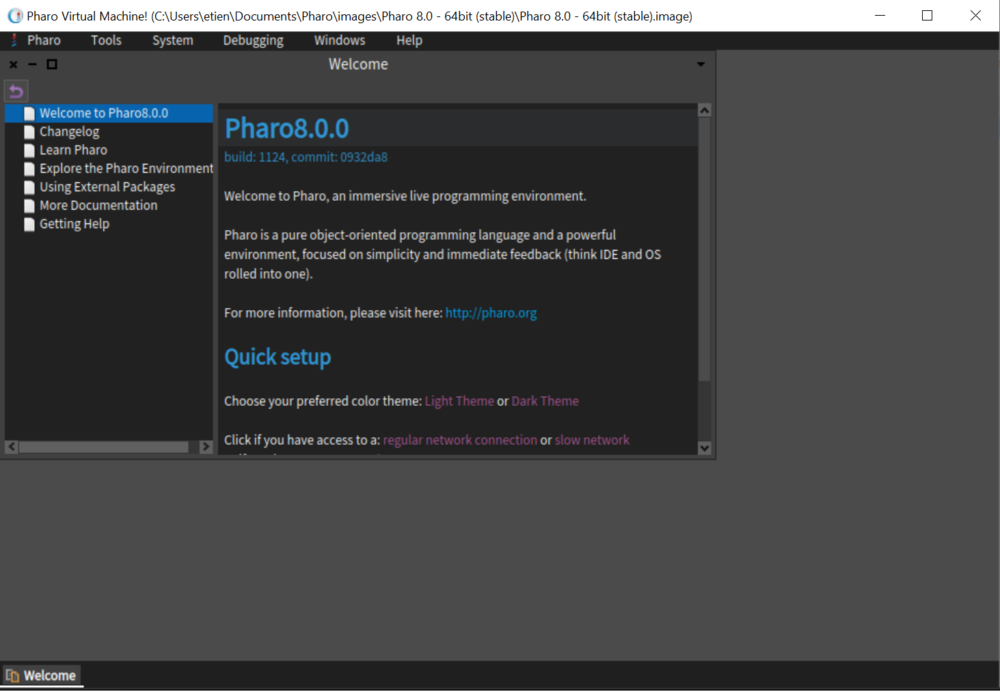

# Instructions to start my Smalltalk Tutorial

| Version | Author | Source | Status | Date | Comments |
| ------- | ----- | ------ | ------ | ----- | --------- |
|  0.1   |  Etienne Mettaz | Pharo | In Progress | 10.12.2020 | |

# Abstract
This is a description of the first steps for this Smalltalk tutorial. No previous knowledge is needed, although some basic programming skills (not necessarily in the Smalltalk language) will help understanding.

# Requierement
You will need an internet connection to clone this repository and download Pharo (see first step).

# First step
Smalltalk has many dialects. I chose Pharo for this project.
Pharo is a modern version of Smalltalk that comes with an IDE including all whats needed to write, run and debug code.First you have to download [Pharo](https://pharo.org/download). Please carefully read the instrucationson the official page. Please follow the next instruction when you have the Pharo Launcher.

# Launch your image
Pharo is composed of 4 different component. The *VM* (virtual machine) is the only one that Operating System dependent. Then you have the *sources* , which contains the source code. There is typically one source per release (8.0 being the latest stable one at the time I write those lines). Then the *changes* file records all deviations from the sources. It can reveal to be very useful if you did something wrong (believe me!), as the whole code is mutable : you can change every bit, from the menu order to the debugger, which is very cool but can be very dangerous, too! Last, we have an *image* file is a snapshot of your work. You can easily store more than one on your computer, and it stores every bit of it, to the content and location of each window on your screen, which is very useful when you want to save your work and continue later.

Let's create that image. Select 'New' on the top left corner. In 'Official Distribution', select 'Pharo 8.0 - XXbit (stable)' (where XX stands for 32 or 64), and 'create image' (you can freely choose a name for your image). On the top bar, select 'Launch', which will open a new window. You should see something like that :

Now, we have to clone this repository, which contains the tutorial. Open the 'Tool' menu that you find by a left-click on the background (alternatively, you can find it on the top bar menu). Select 'Iceberg', 'Add' then 'clone remote repository'. Enter the URL (https://github.com/etienne428/smalltalkTutorial) and select a Local Directory on your computer where it will store your copy (the default option is probably the best one) and click 'Ok'.

You now have a new entry named 'smalltalkTutorial   Not loaded'. Right-click on that line and select 'Packages'. In the window that just opened, right-click on the 'Tutorial' package and select '+ Load'. You can now close this window, as well as the 'Repository'.

You now need to open a Playground. This a window where you can enter code, and run it. Unlike in many other programming language, your Smalltalk code is just part of the running code that the IDE is. Running it won't start a new process, but only a new Thread inside of the programm that will evaluate it and return a value (of course, it can have side-effects).

On the same 'Tool' menu, select 'Playground'. There, write "LearnSmalltalk start." and press the doit button (the green triangle on the top right). The return value is ignored here, what's important is the side effect : it opened a new Window with the tutorial text. That's where the coding begins, for you, and where I teached you what I had to. Follow carefully the instructions, and enjoy this tutorial!

